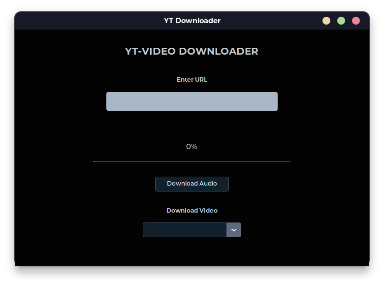
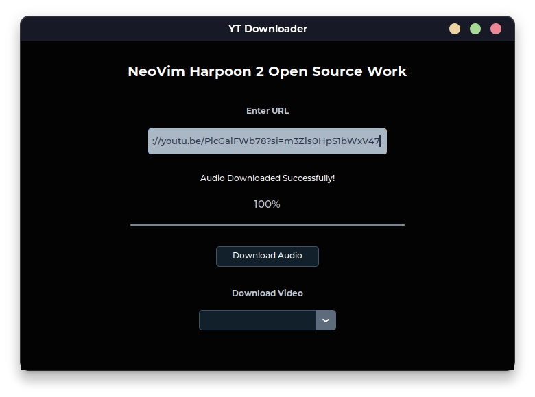
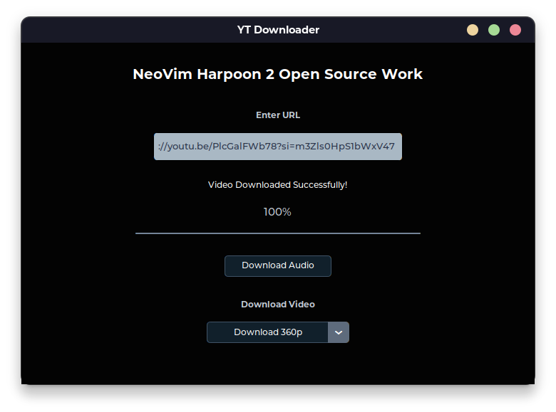
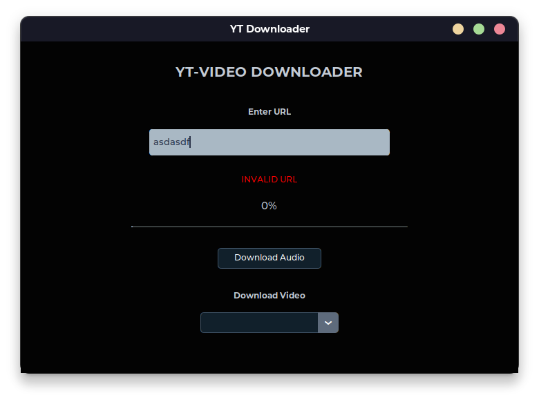

# YouTube Video & Audio Downloader

A simple python GUI application, which can be used -  
1. To download videos at different resolutions. 
2. To download audio of a particular video.    

    
    
    
  

Use [**pyinstaller**](https://pypi.org/project/pyinstaller/) to make it an executable file.

## Libraries Used
[**pytube**](https://github.com/pytube/pytube)  
[**tkinter**](https://docs.python.org/3/library/tkinter.html)  
[**custom tkinter**](https://github.com/TomSchimansky/CustomTkinter)  
