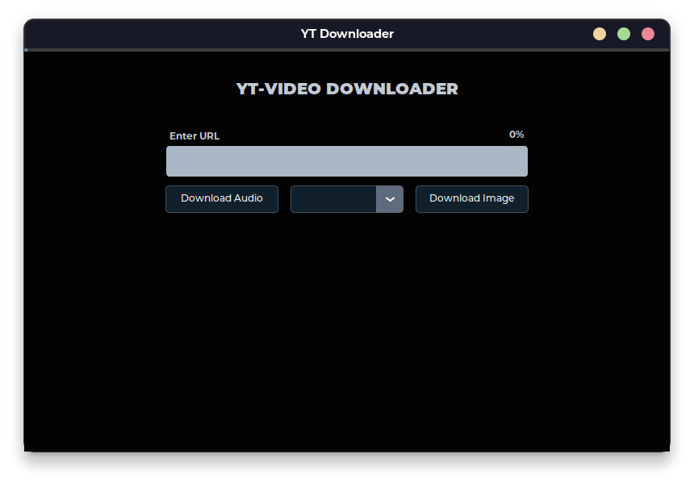
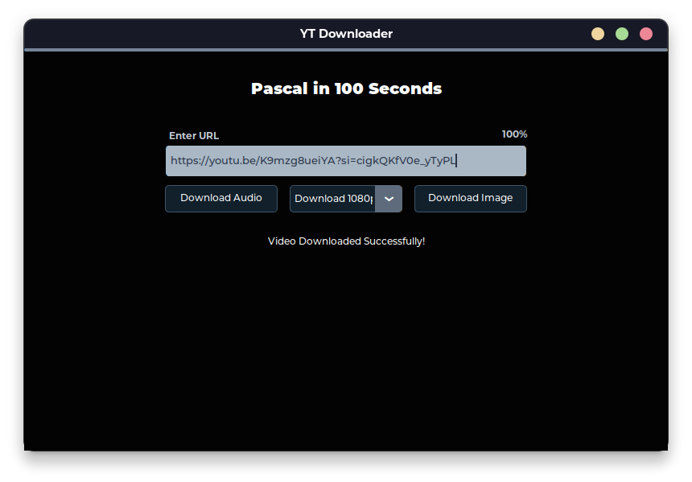

# YouTube Video & Audio Downloader

A simple python GUI application, which can be used -   

1. To download videos at different resolutions.  
2. To download audio of a particular video.
     

## ✅ Installation Guide

### Step 1:

> -> Make sure that **_latest version of python_** is installed in your computer.  
> -> To check if python is installed or not : Enter `python --version` in your command prompt.  
> -> If error occurs, download it from [**here.**](https://www.python.org/downloads/)

### Step 2:

> -> After installing python successfully, now download the contents in the `main` folder from above. **_(Make sure that these three files are in the same folder)_**  
> -> Navigate to the folder in command prompt by `cd folder_name` and enter `pip install -r requirements.txt`

### Step 3:

> -> Now enter the command `pyinstaller --onefile main.py`  
> -> After running the command, pyinstaller will do it's job and make additional folders in your folder.  
> -> In these additional folders, you only need **_dist_** folder, which contains the executable/app.  
> -> Now drag the **_main.exe_** file, into the parent folder (or out of the dist folder into the main folder), and you're good to go! 

 

## 💻 Screenshots

 
