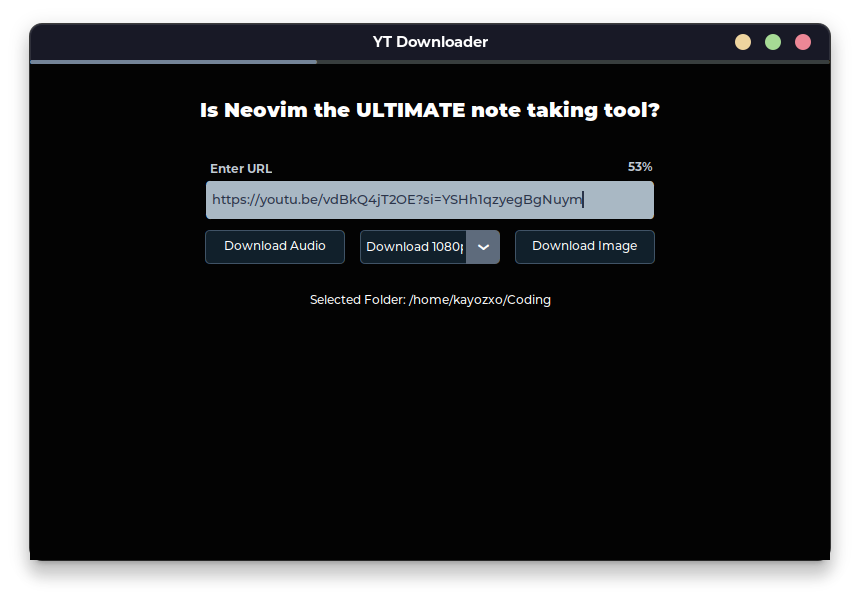

# YouTube Downloader

[](https://travis-ci.org/kayozxo/YouTube-Downloader)
[](LICENSE)

## Description

YouTube Downloader is a simple Python application that allows you to download YouTube videos in multiple resolutions, download thumbnails in JPG format, and extract audio in MP3 format.

## Table of Contents

- [Installation](#installation)
- [Usage](#usage)
- [Features](#features)
- [Dependencies](#dependencies)
- [License](#license)
- [Screenshots](#screenshots)

## Installation

Ensure you have Python installed on your machine. Clone the repository and install the required dependencies.

```bash
# Clone the repository
git clone https://github.com/kayozxo/YouTube-Downloader.git

# Navigate to the project directory
cd YouTube-Downloader/main

# Install dependencies
pip install -r requirements.txt
```

## Usage

To use the YouTube Downloader, provide a YouTube video URL in the entry box and choose the desired download options (video resolution, audio, or thumbnail).

```bash
# Run the application
python main.py
```

## Features

- Download YouTube videos in multiple resolutions.
- Download thumbnails in JPG format.
- Extract audio in MP3 format.

## Dependencies

Ensure you have the following dependencies installed:

- [customtkinter](https://pypi.org/project/customtkinter/)==5.2.1
- [pytube](https://pypi.org/project/pytube/)==15.0.0

You can install them using:

```bash
pip install customtkinter==5.2.1 pytube==15.0.0
```

## License

This project is licensed under the MIT License.

## 💻 Screenshots

<div  align="center">

</div>

<div  align="center">
<div>



</div>
</div>
